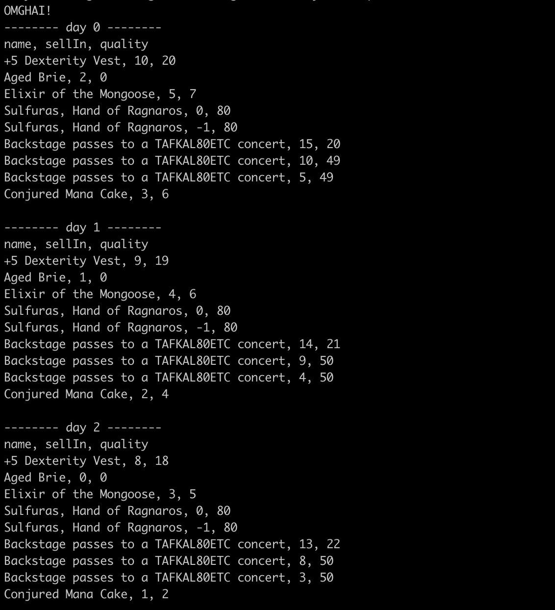

# Gilded Rose Refactoring Kata

## Project description
For the project description and requirements please see the original repo below:\
https://github.com/emilybache/GildedRose-Refactoring-Kata

## Approach
After analysing the existing code and requirements I realised there were five types of items:
1. Normal items
2. Aged brie
3. Sulfuras
4. Backstage passes
5. Conjured items

I then completed the challenge in the following four steps:

1. Create an input/output table using the requirements (see section below)
2. Add automated tests for the existing code using the input output table
3. Refactor the existing code
4. Add the new feature

## Technology used
- Language: Ruby
- Testing Framework: Rspec

## How to run the project:
1. Clone this repository from Github then open in your browser
2. Run 'bundle install' in your terminal after changing into the project folder
3. Run 'ruby lib/texttest_fixture.rb'

An example of code running can be seen below:

## How to run tests:
1. Clone this repository from Github
2. Run 'bundle install' in your terminal after changing into the project folder
3. Run 'rspec'

## Input/Output Table

Input/output table can be seen here:\
https://docs.google.com/spreadsheets/d/1pty1dYV5UBDFsP6HnH_znX9zZx-7bqUZG3ysXtk484E/edit?usp=sharing
